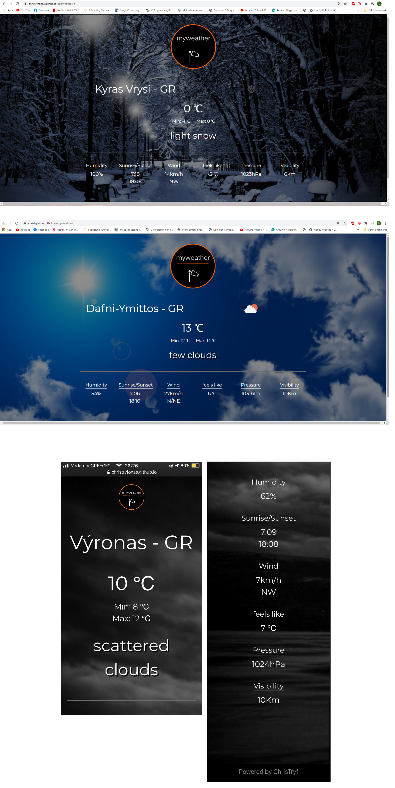

Fully responsive weather app that displays all necessary weather data based on the user's location. The location is accessed after asking the user and giving their permission. It's easy to use with desktop, tablet or smartphone.

Tools : HTML, CSS, Bootstrap, JavaScript, OpenWeatherMap API

Below are some screenshots that demonstrate the app's responsive design. First two pics are taken from desktop and the other two are taken from smartphone iPhone 7. 

.
